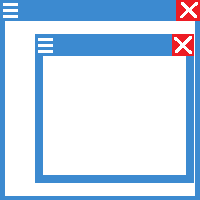
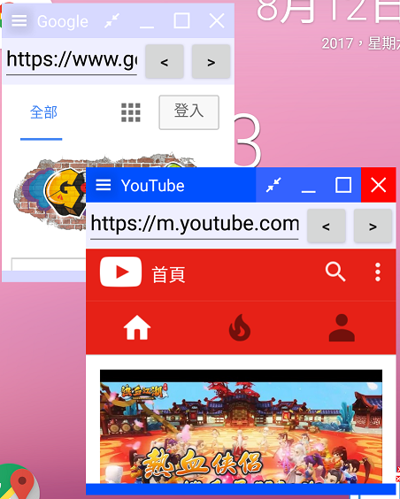
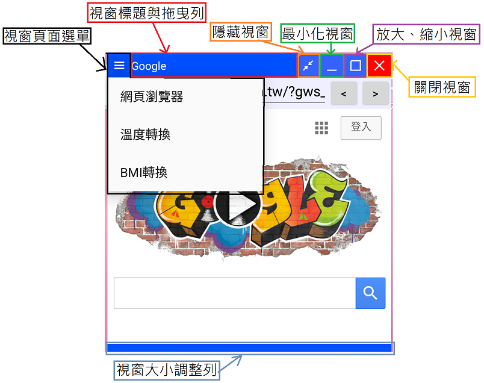

# FloatWindow 浮動視窗
Float Window app for Android\

\
[</img>](https://play.google.com/store/apps/details?id=com.jack850628.floatwindow)
 \
*Demonstration*\
  https://youtu.be/PzKY2Lm5T8A \
  https://youtu.be/K-2nJhK1Ki8 
  \
  *說明*\
  


移植FloatWindoew

複製
```
com.example.jack8.floatwindow
    |-Window
        |-WindowColor.java
        |-WindowConfig.java
        |-WindowFrom.java
        |-WindowStruct.java
```
並將裡面所有的 import com.example.jack8.floatwindow.R; 改成 import <您專案的package name>.R;

在複製
```
   res
    |-layout
    |    |-window.xml
    |    |-hide_menu_item.xml
    |-drawable
        |-close_window.xml
        |-hide_window.xml
        |-max_window.xml
        |-menu_icom.png
        |-micro_window.xml
        |-mini_window.xml
```
並將window.xml裡面的 com.example.jack8.floatwindow.Window.WindowFrom 改成 <您專案的package name>.Window.WindowFrom

再來將
```
   res
    |-values
        |-colors.xml
```
在colors.xml裡面貼上
```
    <color name="windowFoucsColor">#0066FF</color>
    <color name="windowNotFoucsColor">#DDDDDD</color>
    <color name="windowBackground">#FFFFFF</color>
    <color name="closeButton">#FF0000</color>
```

然後再AndroidManifest.xml貼上
```
    <uses-permission android:name="android.permission.SYSTEM_ALERT_WINDOW" />
```

最後讓您的應用程式取得ACTION_MANAGE_OVERLAY_PERMISSION權限就完成了


使用WindowStruct.Builder可以創建一個視窗
創建一個Window最簡當的方式為
```
WindowStruct windowStruct = new WindowStruct.Builder(this,(WindowManager) getSystemService(Context.WINDOW_SERVICE)).show();
```
這樣會創建出一個內容空白的Window \
則
```
WindowStruct windowStruct = new WindowStruct.Builder(this,(WindowManager) getSystemService(Context.WINDOW_SERVICE)).windowPages(new int[]{R.layout.my_layout}).windowPageTitles(new String[]{"My Title"}).show();
```
這將會為您創建出一個具有內容與標題的Window

使用WindowColor可以設定或取得視窗顏色
```
WindowColor windowColor = new WindowColor(this);
int windowBackgroundColor = windowColor.getWindowBackground();//取得視窗背景顏色

windowColor.setTitleBar(0x79afe47a);//ARGB
windowColor.save();//儲存顏色設定
```
