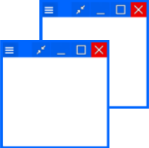

</img>
# FloatWindow 浮動視窗
Floating Window app for Android

The contents of this repository have been deprecated and moved to [FloatWindowCore 浮動視窗核心](https://github.com/jack850628/FloatWindow-Core).\
這個儲存倉庫的內容已經棄用，並轉移至[FloatWindowCore 浮動視窗核心](https://github.com/jack850628/FloatWindow-Core)。\

不管正在使用任何APP，都可以使用"浮動視窗"查看網頁、便條紙等其他小工具。

你可以
- 玩遊戲時查看攻略
- 看影片或直播時將螢幕關閉也可以繼續撥放

[更多介紹](https://fwi.jack.origthatone.com/)

[</img>](https://play.google.com/store/apps/details?id=com.jack850628.floatwindow)
 

以[FloatWindowCore 浮動視窗核心](https://github.com/jack850628/FloatWindow-Core)為基礎製作。