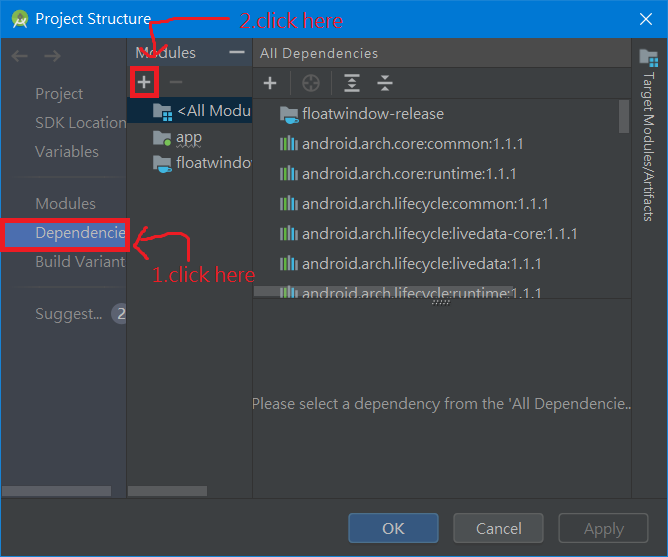
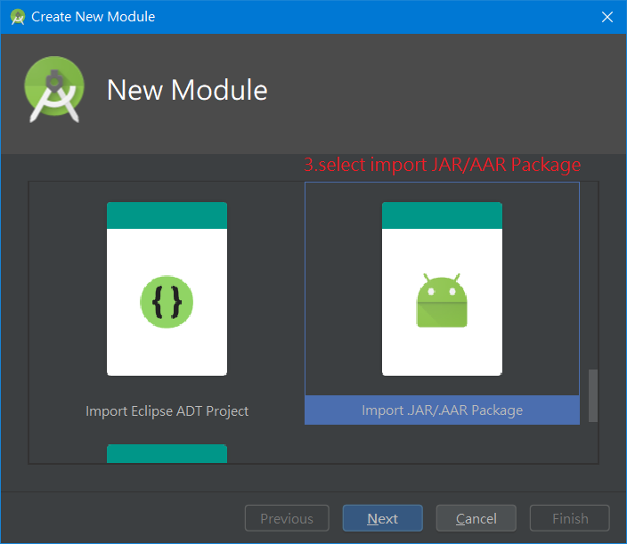
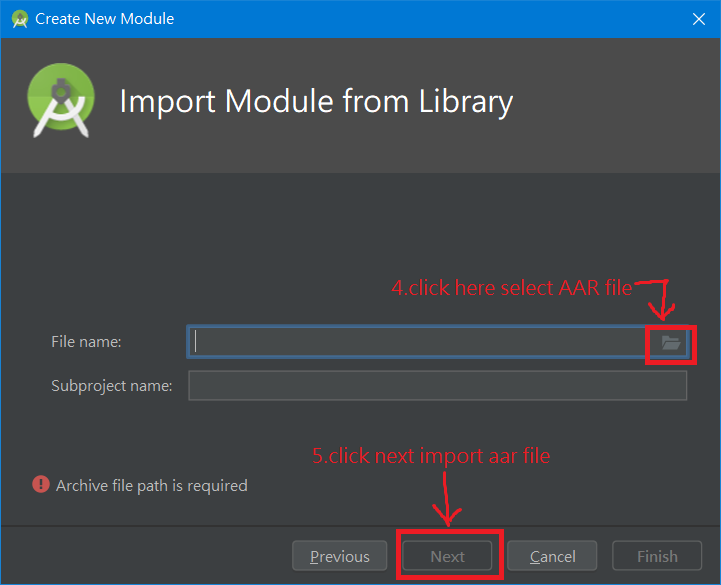

</img>
# FloatWindow 浮動視窗
Float Window app for Android\

\
[</img>](https://play.google.com/store/apps/details?id=com.jack850628.floatwindow)
 \
*Demonstration*\
  https://youtu.be/PzKY2Lm5T8A \
  https://youtu.be/K-2nJhK1Ki8 
  \
  *說明*\
  


## 使用FloatWindoew在自己的APP裡

1.下載[FloatWindow模組](/release_module/floatwindow-release.aar)

2.引入aar檔到專案中 \
</img>
</img>
</img>

3.在專案的build.gradle中加入對FloatWindow的引用
```
dependencies {
    ...
    implementation project(path: ':floatwindow-release')
    ...
}
```

最後，FloatWindow有使用到ACTION_MANAGE_OVERLAY_PERMISSION權限，所以必須在自己的APP中加入跟使用著請求權限的對應處理。

## FloatWindow的使用方法

使用WindowStruct.Builder可以創建一個視窗 \
創建一個Window最簡當的方式為
```
WindowStruct windowStruct = new WindowStruct.Builder(this,(WindowManager) getSystemService(Context.WINDOW_SERVICE)).show();
```
這樣會創建出一個內容空白的Window \
則
```
WindowStruct windowStruct = new WindowStruct.Builder(this,(WindowManager) getSystemService(Context.WINDOW_SERVICE)).windowPages(new int[]{R.layout.my_layout}).windowPageTitles(new String[]{"My Title"}).show();
```
這將會為您創建出一個具有內容與標題的Window

使用WindowColor可以設定或取得視窗顏色
```
WindowColor windowColor = new WindowColor(this);
int windowBackgroundColor = windowColor.getWindowBackground();//取得視窗背景顏色

windowColor.setTitleBar(0x79afe47a);//ARGB
windowColor.save();//儲存顏色設定
```

## License
使用[MIT license](https://github.com/jack850628/FloatWindow/blob/have_AD/LICENSE)
