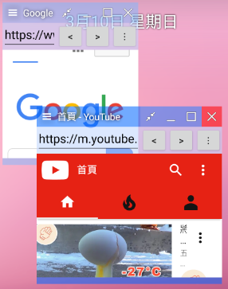

</img>
# FloatWindow 浮動視窗
Float Window app for Android\

\
[</img>](https://play.google.com/store/apps/details?id=com.jack850628.floatwindow)
 \
*Demonstration*\
  https://youtu.be/PzKY2Lm5T8A \
  https://youtu.be/K-2nJhK1Ki8 
  \
  *說明*\
  


## 使用FloatWindoew在自己的APP裡

1.下載[FloatWindow模組](/release_module/floatwindow-release.aar)

2.引入aar檔到專案中 \
</img>
</img>
</img>

3.在專案的build.gradle中加入對FloatWindow的引用
```
dependencies {
    ...
    implementation project(path: ':floatwindow-release')
    ...
}
```

最後，FloatWindow有使用到ACTION_MANAGE_OVERLAY_PERMISSION權限，所以必須在自己的APP中加入跟使用者請求權限的對應處理。

## FloatWindow的使用方法

使用WindowStruct.Builder可以創建一個視窗 \
創建一個Window最簡當的方式為
```
WindowStruct windowStruct = new WindowStruct.Builder(this,(WindowManager) getSystemService(Context.WINDOW_SERVICE)).show();
```
這樣會創建出一個內容空白的Window \
則
```
WindowStruct windowStruct = new WindowStruct.Builder(this,(WindowManager) getSystemService(Context.WINDOW_SERVICE)).windowPages(new int[]{R.layout.my_layout}).windowPageTitles(new String[]{"My Title"}).show();
```
這將會為您創建出一個具有內容與標題的Window

使用WindowColor可以設定或取得視窗顏色
```
WindowColor windowColor = new WindowColor(this);
int windowBackgroundColor = windowColor.getWindowBackground();//取得視窗背景顏色

windowColor.setTitleBar(0x79afe47a);//ARGB
windowColor.save();//儲存顏色設定
```
## Hello World
#### MainActivity.java
```
package com.example.testwindow;

import android.content.Context;
import android.content.Intent;
import android.net.Uri;
import android.os.Build;
import android.provider.Settings;
import android.support.annotation.RequiresApi;
import android.support.v7.app.AppCompatActivity;
import android.os.Bundle;
import android.view.View;
import android.view.WindowManager;
import android.widget.EditText;
import android.widget.TextView;

import com.jack8.floatwindow.Window.WindowStruct;


public class MainActivity extends AppCompatActivity {

    @Override
    protected void onCreate(Bundle savedInstanceState) {
        super.onCreate(savedInstanceState);
        setContentView(R.layout.activity_main);
        if (Build.VERSION.SDK_INT>=Build.VERSION_CODES.M&&!Settings.canDrawOverlays(MainActivity.this))
            startActivityForResult(new Intent(Settings.ACTION_MANAGE_OVERLAY_PERMISSION,
                    Uri.parse("package:" + MainActivity.this.getPackageName())), 1);
        else {
            startFloatWindow();
        }

    }
    private void startFloatWindow(){
        findViewById(R.id.hello).setOnClickListener(new View.OnClickListener() {
            @Override
            public void onClick(View v) {
                //建立一個hello world的FloatWindow視窗
                new WindowStruct.Builder(MainActivity.this, (WindowManager) getSystemService(Context.WINDOW_SERVICE)).
                        windowPages(new int[]{R.layout.hello_page_1, R.layout.hello_page_2}).
                        windowPageTitles(new String[]{"Hello FloatWindow","Submit Hello"}).
                        constructionAndDeconstructionWindow(new WindowStruct.constructionAndDeconstructionWindow() {
                            String helloString = "";
                            @Override
                            public void Construction(Context context, final View view, int i, Object[] objects, final WindowStruct windowStruct) {
                                switch (i){
                                    case 0:
                                        view.findViewById(R.id.get_hello).setOnClickListener(new View.OnClickListener() {
                                            @Override
                                            public void onClick(View v) {
                                                windowStruct.showPage(1);
                                            }
                                        });
                                        break;
                                    case 1:
                                        view.findViewById(R.id.submit).setOnClickListener(new View.OnClickListener() {
                                            EditText helloEdit = view.findViewById(R.id.hello_string);
                                            @Override
                                            public void onClick(View v) {
                                                helloString = helloEdit.getText().toString();
                                                windowStruct.showPage(0);
                                            }
                                        });
                                        break;
                                }
                            }

                            @Override
                            public void Deconstruction(Context context, View view, int i, WindowStruct windowStruct) {

                            }

                            @Override
                            public void onResume(Context context, View view, int i, WindowStruct windowStruct) {
                                if(i == 0)
                                    ((TextView)view.findViewById(R.id.hello_string_view)).setText("Hello " + helloString);
                            }

                            @Override
                            public void onPause(Context context, View view, int i, WindowStruct windowStruct) {

                            }
                        }).show();

            }
        });
    }
    @RequiresApi(api = Build.VERSION_CODES.M)
    @Override
    protected void onActivityResult(int requestCode, int resultCode, Intent data) {
        if (requestCode == 1) {
            if (Settings.canDrawOverlays(this))
                startFloatWindow();
            else
                finish();
        }
    }
}

```
#### activity_main.xml
```
<?xml version="1.0" encoding="utf-8"?>
<android.support.constraint.ConstraintLayout xmlns:android="http://schemas.android.com/apk/res/android"
    xmlns:app="http://schemas.android.com/apk/res-auto"
    xmlns:tools="http://schemas.android.com/tools"
    android:layout_width="match_parent"
    android:layout_height="match_parent"
    tools:context=".MainActivity">

    <Button
        android:id="@+id/hello"
        android:layout_width="wrap_content"
        android:layout_height="wrap_content"
        android:text="hello"
        app:layout_constraintBottom_toBottomOf="parent"
        app:layout_constraintEnd_toEndOf="parent"
        app:layout_constraintStart_toStartOf="parent"
        app:layout_constraintTop_toTopOf="parent" />

</android.support.constraint.ConstraintLayout>
```

#### hello_page_1.xml
```
<?xml version="1.0" encoding="utf-8"?>
<LinearLayout xmlns:android="http://schemas.android.com/apk/res/android"
    android:layout_width="match_parent"
    android:layout_height="match_parent"
    android:orientation="vertical">

    <TextView
        android:id="@+id/hello_string_view"
        android:layout_width="match_parent"
        android:layout_height="wrap_content"
        android:gravity="center_horizontal"
        android:text="TextView" />

    <Button
        android:id="@+id/get_hello"
        android:layout_width="match_parent"
        android:layout_height="wrap_content"
        android:text="get hello" />
</LinearLayout>
```
#### hello_page_2.xml
```
<?xml version="1.0" encoding="utf-8"?>
<LinearLayout xmlns:android="http://schemas.android.com/apk/res/android"
    android:layout_width="match_parent"
    android:layout_height="match_parent"
    android:orientation="vertical">

    <EditText
        android:id="@+id/hello_string"
        android:layout_width="match_parent"
        android:layout_height="wrap_content"
        android:ems="10"
        android:hint="your name"
        android:inputType="textPersonName" />

    <Button
        android:id="@+id/submit"
        android:layout_width="match_parent"
        android:layout_height="wrap_content"
        android:text="submit" />
</LinearLayout>
```

## License
使用[MIT license](https://github.com/jack850628/FloatWindow/blob/have_AD/LICENSE)
